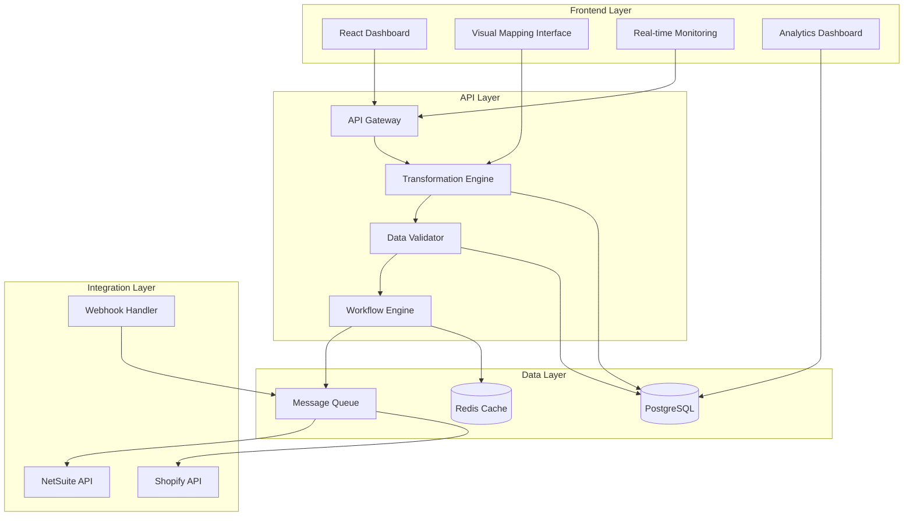

# 🚀 Celigo-Killer Product Sync System - Comprehensive Plan

## Executive Summary

This plan outlines the development of a comprehensive product synchronization platform that surpasses Celigo's capabilities, focusing on advanced data mapping and transformations while delivering enterprise-grade features for NetSuite-Shopify integration.

## 🎯 Core Objectives

1. **Advanced Data Mapping & Transformations** (Priority #1)
2. **Enterprise-Grade Reliability & Monitoring**
3. **Complex Workflow Automation**
4. **Multi-Environment Support**
5. **Advanced Analytics & Compliance**

## 🏗️ System Architecture



## 📋 Detailed Implementation Plan

### Phase 1: Advanced Data Mapping & Transformation Engine

#### 1.1 Transformation Rule Engine
**Objective:** Create a robust JavaScript expression-based transformation system
- **Components:**
  - Expression parser with safe evaluation
  - Built-in functions library (math, string, date, array operations)
  - Variable substitution system
  - Error handling and validation
- **Database Schema:**
  ```sql
  CREATE TABLE transformation_rules (
    id UUID PRIMARY KEY,
    name TEXT NOT NULL,
    description TEXT,
    rule_type TEXT CHECK (rule_type IN ('expression', 'lookup', 'conditional', 'script')),
    expression TEXT,
    parameters JSONB DEFAULT '{}',
    test_cases JSONB DEFAULT '[]',
    is_active BOOLEAN DEFAULT true,
    created_by UUID REFERENCES auth.users,
    created_at TIMESTAMP WITH TIME ZONE DEFAULT NOW()
  );
  ```

#### 1.2 Field Mapping Templates
**Objective:** Reusable transformation templates for common scenarios
- **Features:**
  - Pre-built templates for common mappings
  - Template variables and customization
  - Template versioning and inheritance
  - Template marketplace/community sharing

#### 1.3 Data Type Conversion Utilities
**Objective:** Comprehensive type conversion and formatting
- **Supported Conversions:**
  - String ↔ Number ↔ Date ↔ Boolean
  - Currency formatting and conversion
  - Unit conversions (weight, dimensions)
  - Custom formatters (phone, address, etc.)

#### 1.4 Lookup Tables & Reference Data
**Objective:** Dynamic reference data management
- **Features:**
  - Database-backed lookup tables
  - External API integration for reference data
  - Caching and performance optimization
  - Version control for reference data

#### 1.5 Conditional Logic Engine
**Objective:** Complex if-then-else transformation logic
- **Capabilities:**
  - Nested conditional statements
  - Multiple conditions with AND/OR logic
  - Fallback values and error handling
  - Visual condition builder

#### 1.6 Array/Object Manipulation
**Objective:** Advanced data structure transformations
- **Functions:**
  - Array filtering, mapping, reducing
  - Object property manipulation
  - JSON path operations
  - Complex data restructuring

#### 1.7 Custom Script Execution
**Objective:** Full JavaScript execution environment
- **Security Features:**
  - Sandboxed execution
  - Resource limits (CPU, memory)
  - Timeout controls
  - Audit logging

#### 1.8 Testing & Validation Framework
**Objective:** Comprehensive transformation testing
- **Features:**
  - Unit test generation
  - Mock data providers
  - Performance benchmarking
  - Regression testing

### Phase 2: Visual Mapping Interface & Rule Builder

#### 2.1 Drag-and-Drop Mapping Canvas
- Visual field mapping with drag-and-drop
- Real-time preview of transformations
- Auto-suggestions based on data types
- Mapping validation and error highlighting

#### 2.2 Rule Builder Interface
- Visual programming interface for transformations
- Pre-built function blocks
- Custom function creation
- Rule chaining and dependencies

#### 2.3 Template Management System
- Save and reuse mapping configurations
- Template sharing across projects
- Version control for mappings
- Template marketplace

### Phase 3: Data Validation & Quality Assurance

#### 3.1 Schema Validation Engine
- JSON Schema-based validation
- Custom validation rules
- Data quality scoring
- Validation rule templates

#### 3.2 Data Quality Monitoring
- Automated quality checks
- Data profiling and analysis
- Anomaly detection
- Quality dashboards

#### 3.3 Error Recovery Mechanisms
- Automatic error classification
- Retry strategies with backoff
- Manual intervention workflows
- Error pattern analysis

### Phase 4: Complex Workflow Automation

#### 4.1 Workflow Engine
- Visual workflow designer
- Conditional branching
- Parallel execution
- Error handling paths

#### 4.2 Event-Driven Processing
- Webhook event handling
- Real-time data processing
- Event correlation and aggregation
- Custom event triggers

#### 4.3 Dependency Management
- Task dependencies and ordering
- Circular dependency detection
- Parallel processing optimization
- Resource allocation

### Phase 5: Real-time Monitoring & Alerting

#### 5.1 Real-time Dashboards
- Live sync status monitoring
- Performance metrics
- Error rate tracking
- Queue status visualization

#### 5.2 Intelligent Alerting
- Configurable alert rules
- Multi-channel notifications (email, Slack, SMS)
- Alert escalation policies
- Alert correlation and grouping

#### 5.3 Performance Analytics
- Sync performance metrics
- Bottleneck identification
- Capacity planning insights
- Historical trend analysis

### Phase 6: Multi-Environment Support

#### 6.1 Environment Management
- Development, staging, production environments
- Environment-specific configurations
- Data isolation and security
- Cross-environment deployment

#### 6.2 Configuration Management
- Environment variables management
- Feature flags and toggles
- Configuration versioning
- Secret management

### Phase 7: Advanced Analytics & Reporting

#### 7.1 Business Intelligence Dashboard
- Sync success/failure analytics
- Data volume and throughput metrics
- Cost analysis and optimization
- ROI tracking and reporting

#### 7.2 Custom Report Builder
- Drag-and-drop report creation
- Scheduled report generation
- Export capabilities (PDF, Excel, CSV)
- Report sharing and collaboration

### Phase 8: API Management & Rate Limiting

#### 8.1 Intelligent Rate Limiting
- Dynamic rate limit adjustment
- Queue-based request management
- Burst handling and smoothing
- Rate limit monitoring and alerts

#### 8.2 API Optimization
- Request batching and optimization
- Connection pooling
- Caching strategies
- API usage analytics

### Phase 9: Audit Trails & Compliance

#### 9.1 Comprehensive Auditing
- All data changes logged
- User action tracking
- System event logging
- Tamper-proof audit trails

#### 9.2 Compliance Features
- GDPR compliance tools
- Data retention policies
- Audit report generation
- Compliance dashboards

### Phase 10: Enterprise Features & Scaling

#### 10.1 Multi-Tenant Architecture
- Tenant isolation
- Resource quotas
- Usage metering
- Billing integration

#### 10.2 High Availability & Scaling
- Horizontal scaling capabilities
- Database replication
- Load balancing
- Disaster recovery

## 🔧 Technical Specifications

### Backend Architecture
- **Language:** TypeScript/Node.js
- **Framework:** Express.js with TypeScript
- **Database:** PostgreSQL with PostGIS
- **Cache:** Redis
- **Queue:** Bull/BullMQ
- **ORM:** Prisma or TypeORM

### Frontend Architecture
- **Framework:** React 18+ with TypeScript
- **State Management:** Zustand or Redux Toolkit
- **UI Library:** Ant Design + custom components
- **Charts:** Recharts or D3.js
- **Build Tool:** Vite

### Security Features
- **Authentication:** Supabase Auth
- **Authorization:** Row Level Security (RLS)
- **API Security:** JWT tokens, rate limiting
- **Data Encryption:** AES-256 encryption at rest
- **Audit Logging:** Comprehensive activity logging

### Performance Targets
- **Sync Latency:** < 30 seconds for 95% of operations
- **Throughput:** 1000+ products per minute
- **Uptime:** 99.9% SLA
- **Concurrent Users:** 100+ simultaneous users

## 📊 Success Metrics

1. **Data Accuracy:** 99.9% data transformation accuracy
2. **System Reliability:** 99.9% uptime with < 0.1% data loss
3. **User Productivity:** 80% reduction in manual mapping work
4. **Time to Value:** < 1 hour setup for basic integrations
5. **Scalability:** Support for 1M+ products across multiple tenants

## 🚀 Implementation Roadmap

### Month 1-2: Foundation (Phase 1)
- Advanced transformation engine
- Basic visual mapping interface
- Core data validation

### Month 3-4: Core Features (Phases 2-3)
- Complete visual mapping system
- Workflow automation
- Advanced validation

### Month 5-6: Enterprise Features (Phases 4-5)
- Real-time monitoring
- Multi-environment support
- Advanced analytics

### Month 7-8: Production Ready (Phases 6-8)
- API management
- Audit trails
- Performance optimization

### Month 9-10: Enterprise Scale (Phases 9-10)
- Multi-tenant architecture
- Advanced scaling features
- Compliance and security hardening

## 💡 Innovation Highlights

1. **AI-Powered Mapping:** Machine learning suggestions for field mappings
2. **Visual Programming:** No-code transformation rule builder
3. **Real-time Collaboration:** Multi-user editing of mappings
4. **Predictive Analytics:** ML-based performance predictions
5. **Auto-Healing:** Self-correcting transformation rules

This comprehensive plan positions your platform as the definitive alternative to Celigo, offering superior capabilities, better user experience, and enterprise-grade reliability.